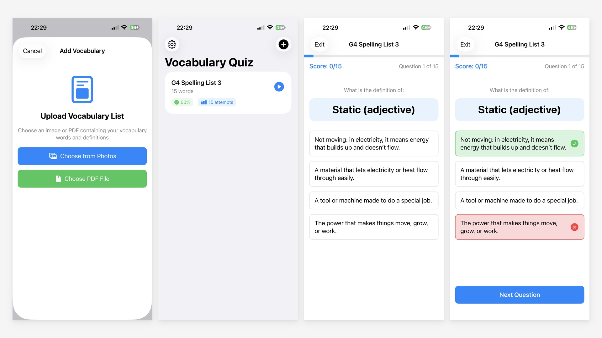

# 词汇测验生成器

一款智能的 iOS 教育应用，通过从上传的文档中自动生成测验，帮助学生高效学习和记忆词汇。Cynthia 用 Claude Code 做的第一版，我帮忙调试和设置环境。

[English](./README.md) | 简体中文



## 功能特性

### 智能内容提取

- 上传包含词汇表的 PDF 或图片文件
- OCR 技术从文档中提取文本
- 智能解析识别多种格式的单词-定义对：
  - "单词 - 定义" 或 "单词: 定义"
  - 编号列表（1. 单词 - 定义）
  - 多行格式（单词在一行，定义在下一行）
  - 支持自定义分隔符

### 互动测验系统

- 自动生成多项选择题
- 随机排列答案选项以防止位置记忆
- 进度追踪与可视化进度条
- 实时分数显示
- 滑动删除词汇集

### 游戏化学习体验

- 即时视觉反馈（正确为绿色，错误为红色）
- 正确/错误答案的系统音效
- 触觉反馈增强参与感
- 完成测验时显示奖杯
- 显示成绩百分比

### 二次学习机会

- 自动追踪答错的单词
- 可选的二次练习轮次专注于遗漏的词汇
- 通过针对性练习帮助强化薄弱环节

### 数据持久化

- SwiftData 集成实现本地存储
- 词汇集自动保存
- 追踪每个单词的统计数据（正确/错误次数）
- 查看每个词汇集的准确率百分比

### 自定义与设置

- 可调节答案选项数量（2-6个）
- 开关音效
- 开关触觉反馈
- 支持深色模式
- 无障碍功能

## 技术架构

### 使用的技术

- **SwiftUI**: 现代声明式 UI 框架
- **SwiftData**: 数据持久化和管理
- **Vision Framework**: 图像 OCR 文本识别
- **PDFKit**: PDF 文本提取和渲染
- **AVFoundation**: 音频反馈系统
- **UIKit Integration**: 文档选择器和照片选择器

### 项目结构

```
spellinglist/
├── Models.swift              # 数据模型（VocabularyWord, VocabularySet, QuizSession）
├── OCRService.swift          # OCR 和文本提取服务
├── VocabularyParser.swift    # 单词-定义对的文本解析逻辑
├── FileUploadView.swift      # 文档/图片上传界面
├── HomeView.swift            # 主屏幕与词汇集列表
├── QuizView.swift            # 游戏化测验界面
├── SettingsView.swift        # 应用设置和偏好
├── ContentView.swift         # 根视图
└── spellinglistApp.swift     # 应用入口
```

### 核心组件

#### 模型

- **VocabularyWord**: 单个单词及其定义和统计数据
- **VocabularySet**: 来自单个文档的单词集合
- **QuizQuestion**: 包含选项和正确答案的问题结构
- **QuizSession**: 管理测验状态和逻辑的可观察对象

#### 服务

- **OCRService**: 使用 Vision 框架处理图像和 PDF 的文本提取
- **VocabularyParser**: 具有模式识别功能的智能解析，支持多种格式

## 使用方法

1. **添加词汇**
   - 点击右上角的"+"按钮
   - 选择从相册上传或选择 PDF 文件
   - 查看提取的单词
   - 编辑或删除任何解析错误的条目
   - 保存词汇集

2. **进行测验**
   - 从主屏幕点击任意词汇集
   - 阅读单词并选择正确的定义
   - 即时获得答案反馈
   - 完成所有问题

3. **练习错题**
   - 完成测验后，查看你的分数
   - 如果有答错的单词，点击"练习错题"
   - 完成仅包含答错单词的二次练习

4. **追踪进度**
   - 在主屏幕查看准确率百分比
   - 查看每个词汇集的总尝试次数
   - 监控学习进步情况

## 系统要求

- iOS 17.0 或更高版本
- Xcode 15.0 或更高版本
- Swift 5.9 或更高版本

## 构建项目

1. 在 Xcode 中打开 `spellinglist.xcodeproj`
2. 选择目标设备或模拟器
3. 按 Cmd+R 构建并运行

## 未来增强功能

- [ ] 同义词/反义词集成
- [ ] 为家长和教师提供进度分析仪表板
- [ ] 多人游戏或挑战模式以提升课堂参与度
- [ ] 跨设备云同步
- [ ] 导出测验结果
- [ ] 自定义测验模式（反向、配对、填空）
- [ ] 间隔重复算法
- [ ] 单词语音发音
- [ ] 深色模式主题自定义

## 隐私

- 所有数据使用 SwiftData 本地存储在设备上
- 不向外部服务器传输用户数据
- OCR 处理使用 Apple 的 Vision 框架在设备上完成
- 无需账户或登录

## 许可证

版权所有 © 2025。保留所有权利。

## 支持

如有问题或功能请求，请联系开发者或在 GitHub 上提出 issue。
